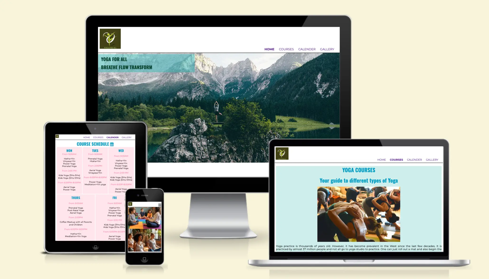

# Yoga-for-All
Yoga for all is a website created for the "Yoga for All" studio located in Nuremberg, Germany to make Yoga accessible to individuals of all age groups and make it a part of their health transformation journey. The studio is equipped with modern Yoga practices like Aerial Yoga that uses hammock strings to teach inversions to traditional Yoga practices like Vinyasa, Hatha and Yin. One can choose any Yoga style and join any class by viewing the calender schedule for that day. 

The studio holds special classes for expecting mothers and new moms as well as children above 3 years of age. There are special coffee meetups for children and parents to have a relaxed, fun-filled meetup time for families. View the live site [here](https://niraja85.github.io/Yoga-for-All/)

## Features

### Site wide existing features
* Navigation Bar
    - Contains links to Home, Courses, Calender and Gallery and is responsive on all devices.
    - This will help users to easily navigate across different pages on all devices.

        

