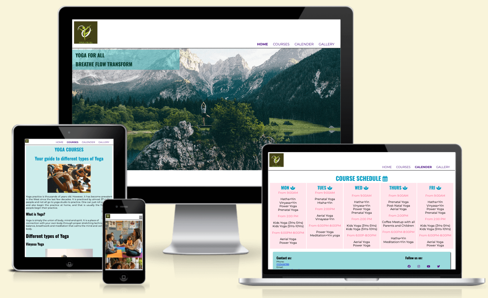

# Yoga for All

Yoga for all is a website created for the studio 'Yoga for All' ´which is located in Nuremberg,Germany. It holds yoga classes for adults, children , prenatal yoga classes and yoga classes for new moms who want to start their fitness journey. It has both traditional yoga classes as well as fairly modern style of yoga as well like aerial yoga which makes exercise fun. Visit the live site [here](https://niraja85.github.io/Yoga-for-All/)

## Features

### Site wide
* Navigation menu
    * Contains links to website logo, home page, courses, gallery and calender pages which are responsive on all devices.
    * This will help users to easily navigate through the different pages without clicking the ‘back’ button.

    

* Navigation menu for mobile
    * The various page links are on the right side and visible on clicking the toggle. The logo remains on the left side.   

   

 * Footer
     * This will contain social media icons as links that  when clicked upon will open in new tabs. It is also accessible to visually impaired who maybe using a screen reader by the use of aria-labels. The second part of the footer on the left side contains the contact information with email id and phone number.  
     * These contact details will help people get in touch with me directly for any queries or any additional information user needs apart from that stated in the website.

     

        
